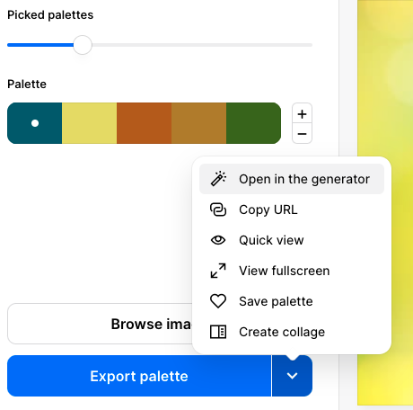

Right click on the image on your webpage and select `Copy image address`:

In a new browser window, go to [coolors.co](https://coolors.co){:target="_blank"} and select the `Tools` menu then `Image picker`:

Click on the `Browse image` button: 

Click on `URL` then paste the copied image address into the `Image URL` box. Click `OK`:

Sample palettes are created from your image. You can use the `picked palette` slider to select which colour scheme you want to use:

When you are happy with the palette, click on the dropdown arrow of the `Export palette` button and select `Open in the generator`:

The final palette will be shown. The coded letters and numbers are the hex codes for your chosen colours. Update the variable values in your `default.css` file to use these new colours:

--- code ---
---
language: html
filename: default.css
line_numbers: true
line_number_start: 4
line_highlights: 5-14
---

:root {
  --primary: #08586B;
  --onprimary:#4f4e4e;
  --secondary: #E0DB54;
  --onsecondary:#ffffff;
  --tertiary:#AF5C08;
  --ontertiary: #ffffff;
  --page:#ffffff;
  --onpage:#000000;
  --detail: #AB7C1C;
  --detail2: #38640D;
}

--- /code ---
