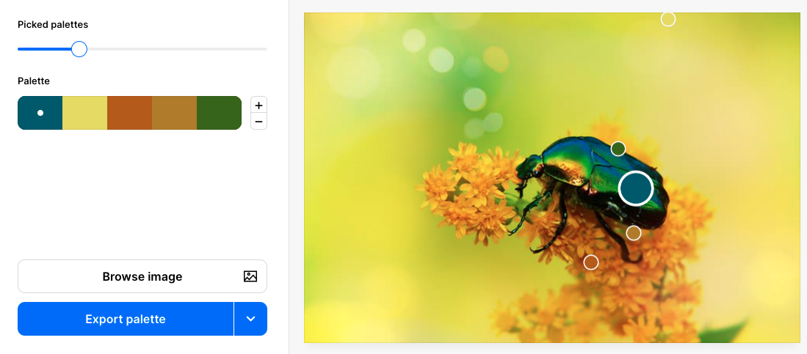
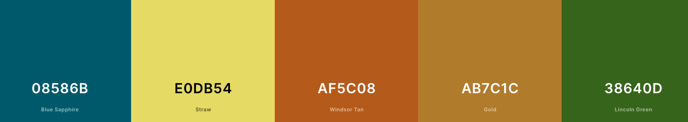

Fais un clic droit sur l'image de ta page web et sélectionne « Copier l'adresse de l'image » ou « Copier le lien de l'image » :

Dans une nouvelle fenêtre de ton navigateur, va sur [coolors.co](https://coolors.co){:target="_blank"}. Sélectionne le menu « Tools » puis « Image picker ».

Clique sur le bouton « Browse image ».

Clique sur « URL » puis colle l'adresse de l'image copiée dans la case « Image URL ». Clique sur « OK ».

Des échantillons de palettes sont créés à partir de ton image. Tu peux utiliser le curseur « Picked palettes » pour sélectionner le schéma de couleurs que tu veux utiliser.

Lorsque tu es satisfait de la palette, clique sur la flèche déroulante du bouton « Export palette » et sélectionne « Open in the generator ».

La palette finale est affichée. Les lettres et les chiffres codés sont les codes hexadécimaux des couleurs que tu as choisies. Mets à jour les valeurs des variables dans ton fichier `default.css` pour utiliser ces nouvelles couleurs.

## --- code ---

language: html
filename: default.css
line_numbers: true
line_number_start: 4
line_highlights: 5-14
----------------------------------------------------------

:root {
\--primary: #08586B;
\--onprimary:#4f4e4e;
\--secondary: #E0DB54;
\--onsecondary:#ffffff;
\--tertiary:#AF5C08;
\--ontertiary: #ffffff;
\--page:#ffffff;
\--onpage:#000000;
\--detail: #AB7C1C;
\--detail2: #38640D;
}

\--- /code ---
