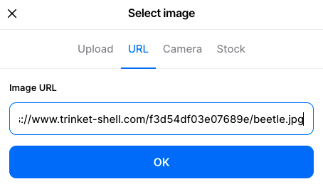
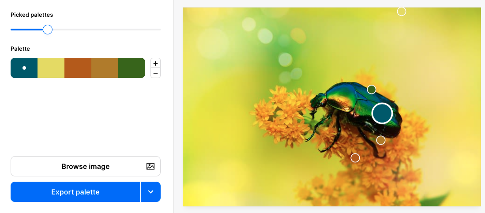

Klik met de rechtermuisknop op de afbeelding op jouw webpagina en selecteer `Copy image address` of `Copy Image Link`:

Ga in een nieuw browservenster naar [coolors.co](https://coolors.co){:target="_blank"}. Selecteer het menu 'Tools' en dan 'Image picker'.

Klik op de knop 'Browse image'.

Klik op 'URL' en plak het gekopieerde afbeeldingsadres in het vak 'Image URL'. Klik op 'OK'.

Er worden voorbeeldpaletten gemaakt op basis van jouw afbeelding. Je kunt de schuifregelaar 'Picked palettes' gebruiken om te selecteren welk kleurenschema je wilt gebruiken.

Als je tevreden bent met het palet, klik dan op de dropdown-pijl van de 'Export palette' knop en selecteer 'Open in the generator'.

Het uiteindelijke palet wordt getoond. De gecodeerde letters en cijfers zijn de hexadecimale codes van de door jou gekozen kleuren. Update de variabelewaarden in je `default.css` bestand om deze nieuwe kleuren te gebruiken.

--- code ---
---
language: html
filename: default.css
line_numbers: true
line_number_start: 4
line_highlights: 5-14
---

:root {
  --primary: #08586B;
  --onprimary:#4f4e4e;
  --secondary: #E0DB54;
  --onsecondary:#ffffff;
  --tertiary:#AF5C08;
  --ontertiary: #ffffff;
  --page:#ffffff;
  --onpage:#000000;
  --detail: #AB7C1C;
  --detail2: #38640D;
}

--- /code ---
